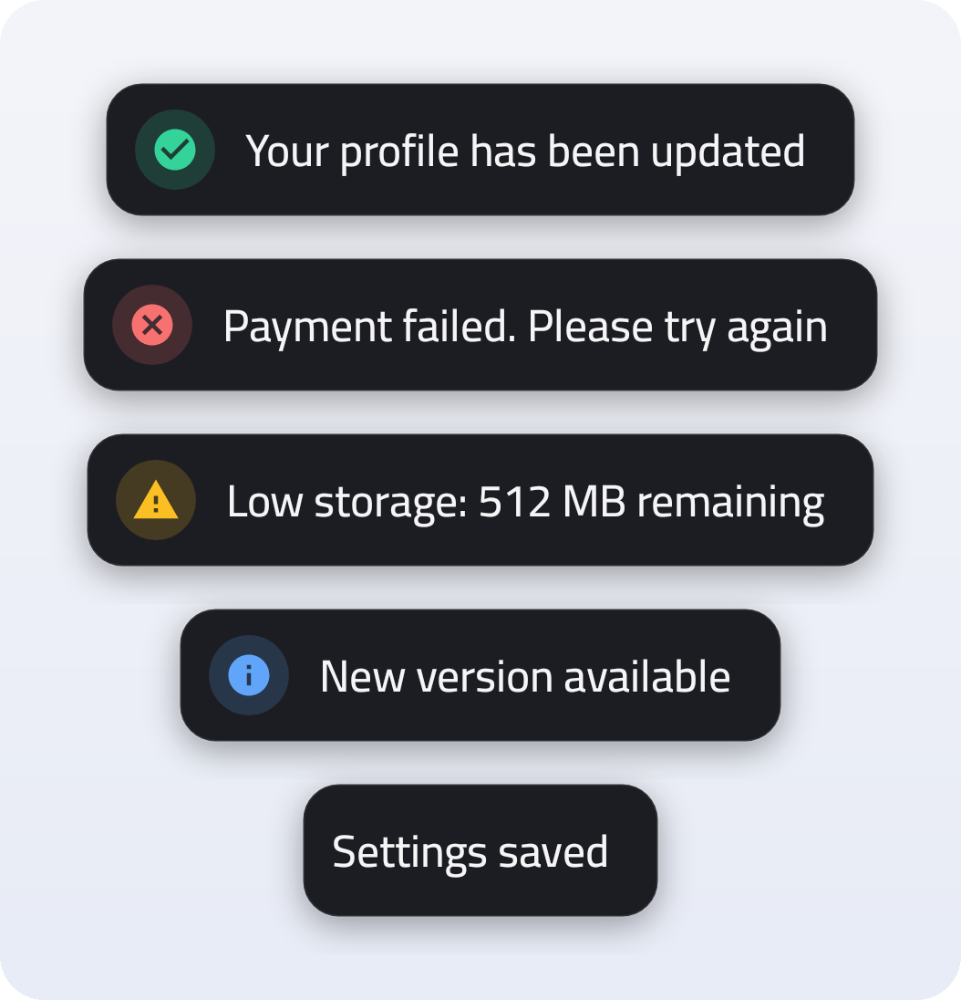
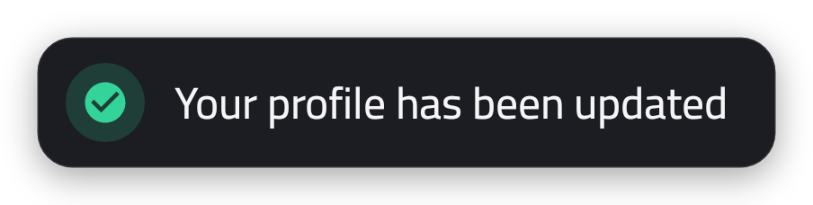
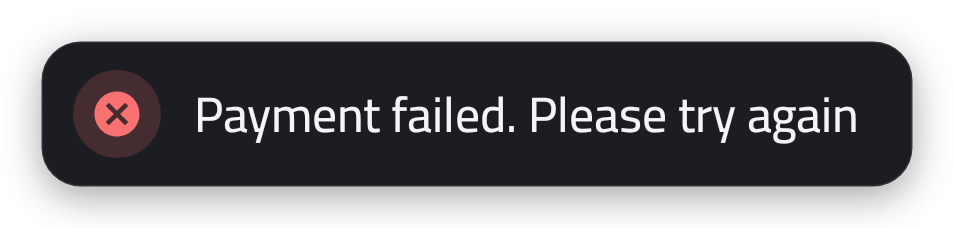
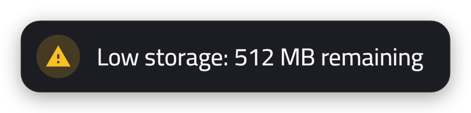
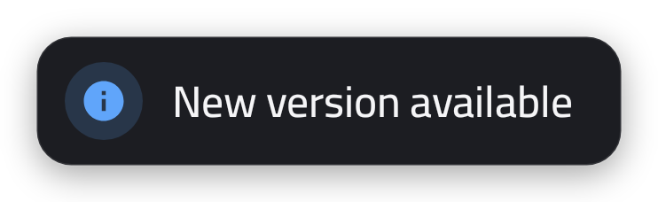
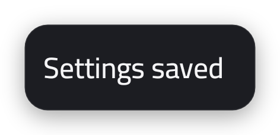
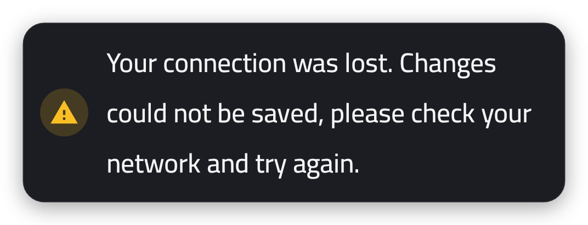
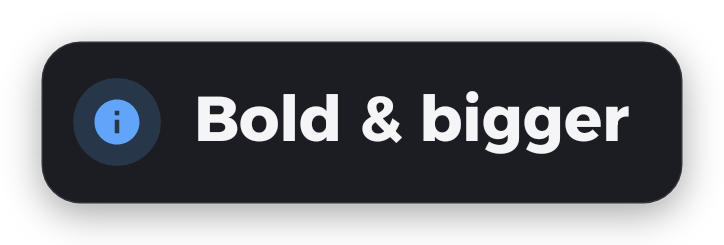
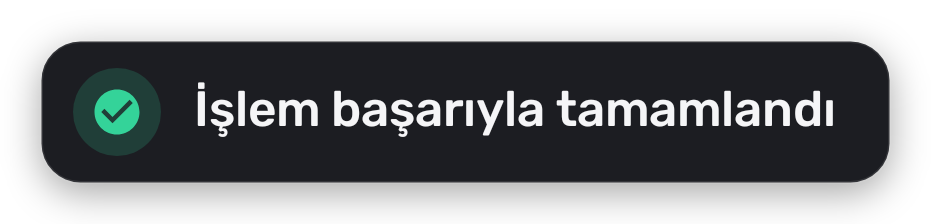
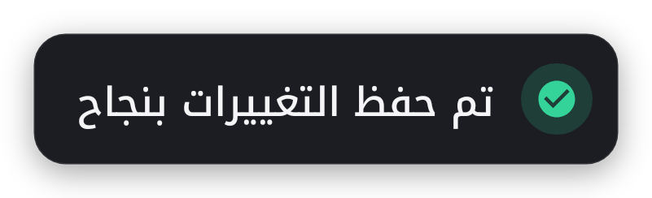

<div align="center">

# Toastoy

**Modern, multi-line toasts for Android — one line of code, no boilerplate.**

[](https://jitpack.io/#muhammedelsami/Toastoy)
[](https://developer.android.com/about/versions/nougat)
[](https://kotlinlang.org)
[](LICENSE)
[](https://github.com/muhammedelsami/Toastoy/stargazers)



<sub>Website: <a href="https://muhammedelsami.github.io/Toastoy/">muhammedelsami.github.io/Toastoy</a></sub>

</div>

---

## Why Toastoy?

The stock Android `Toast` is plain, and every custom one you build yourself needs a layout, a
background, an icon, and a way to survive long messages. Toastoy gives you a finished design
that fits any app, and gets out of your way.

- **Five ready-made types** — `default`, `success`, `error`, `warning`, `info`, each with a tinted vector icon.
- **Never cut off** — the card hugs short messages and wraps long ones onto up to four lines.
  It grows to the screen width before it starts wrapping, and stays capped on tablets.
- **Looks right everywhere** — a dark, rounded surface that reads on both light and dark themes.
- **Typography you control** — eight bundled variable fonts, any weight from thin to black, any size.
- **Multilingual** — Latin, Turkish and Arabic scripts out of the box; RTL layouts supported.
- **Zero collisions** — every resource is prefixed with `toastoy_`, so it can't clash with your app.
- **Tiny API** — five static functions; call them from an `Activity` or any `Context`.

## Installation

Add JitPack to your repositories:

<details open>
<summary><b>settings.gradle.kts</b> (Kotlin DSL)</summary>

```kotlin
dependencyResolutionManagement {
    repositories {
        google()
        mavenCentral()
        maven("https://jitpack.io")
    }
}
```
</details>

<details>
<summary><b>settings.gradle</b> (Groovy)</summary>

```groovy
dependencyResolutionManagement {
    repositories {
        google()
        mavenCentral()
        maven { url 'https://jitpack.io' }
    }
}
```
</details>

Then add the dependency to your module:

```kotlin
dependencies {
    implementation("com.github.muhammedelsami:Toastoy:<latest-version>")
}
```

Replace `<latest-version>` with the version shown on the JitPack badge above.

## Quick start

```kotlin
Toastoy.showSuccessToast(this, "Your profile has been updated")
```

That's it. Every type has the same signature:

```kotlin
Toastoy.showDefaultToast(this, "Settings saved")
Toastoy.showSuccessToast(this, "Your profile has been updated")
Toastoy.showErrorToast(this,   "Payment failed. Please try again")
Toastoy.showWarningToast(this, "Low storage: 512 MB remaining")
Toastoy.showInfoToast(this,    "New version available")
```

`this` can be an `Activity`, a `Fragment`'s `requireContext()`, or any other `Context`.

<details>
<summary><b>Java</b></summary>

```java
Toastoy.showSuccessToast(this, "Your profile has been updated");
Toastoy.showErrorToast(this, "Payment failed", ToastoyFont.RUBIK, 16f, ToastoyFontWeight.SEMI_BOLD);
```
</details>

## Toast types

| Type | Preview |
|------|---------|
| `showSuccessToast` |  |
| `showErrorToast`   |  |
| `showWarningToast` |  |
| `showInfoToast`    |  |
| `showDefaultToast` |  |

Long messages wrap instead of being truncated:



## Customization

Every `show*Toast` function takes three optional parameters after the message:

| Parameter    | Type                | Default  | Description                              |
|--------------|---------------------|----------|------------------------------------------|
| `font`       | `ToastoyFont`       | `CAIRO`  | One of the bundled fonts (see below)     |
| `textSize`   | `Float`             | `14f`    | Text size in **sp**                      |
| `fontWeight` | `ToastoyFontWeight` | `MEDIUM` | Weight on the font's `wght` axis         |

```kotlin
// style a single toast
Toastoy.showInfoToast(this, "Bold & bigger", ToastoyFont.ALEXANDRIA, 20f, ToastoyFontWeight.BOLD)

// or use named arguments for just the ones you need
Toastoy.showWarningToast(this, "Heads up", fontWeight = ToastoyFontWeight.SEMI_BOLD)
```



### Global defaults

Set them once — for example in your `Application` class — and every toast will use them:

```kotlin
Toastoy.defaultFont = ToastoyFont.RUBIK
Toastoy.defaultTextSize = 15f
Toastoy.defaultFontWeight = ToastoyFontWeight.SEMI_BOLD
```

### Fonts

Toastoy ships eight free **variable** fonts from [Google Fonts](https://fonts.google.com)
(SIL Open Font License, see [`FONTS_LICENSE.md`](toastoy/FONTS_LICENSE.md)).
All of them cover **English, Turkish and Arabic**.

| `ToastoyFont`       | Font                                                                   | Weight range |
|---------------------|------------------------------------------------------------------------|--------------|
| `CAIRO` *(default)* | [Cairo](https://fonts.google.com/specimen/Cairo)                       | 200 – 1000   |
| `ALEXANDRIA`        | [Alexandria](https://fonts.google.com/specimen/Alexandria)             | 100 – 900    |
| `RUBIK`             | [Rubik](https://fonts.google.com/specimen/Rubik)                       | 300 – 900    |
| `READEX_PRO`        | [Readex Pro](https://fonts.google.com/specimen/Readex+Pro)             | 160 – 700    |
| `CHANGA`            | [Changa](https://fonts.google.com/specimen/Changa)                     | 200 – 800    |
| `VAZIRMATN`         | [Vazirmatn](https://fonts.google.com/specimen/Vazirmatn)               | 100 – 900    |
| `EL_MESSIRI`        | [El Messiri](https://fonts.google.com/specimen/El+Messiri)             | 400 – 700    |
| `NOTO_KUFI_ARABIC`  | [Noto Kufi Arabic](https://fonts.google.com/specimen/Noto+Kufi+Arabic) | 100 – 900    |

<p>


</p>

### Weights

`ToastoyFontWeight` maps to the `wght` axis: `THIN (100)`, `EXTRA_LIGHT (200)`, `LIGHT (300)`,
`NORMAL (400)`, `MEDIUM (500)`, `SEMI_BOLD (600)`, `BOLD (700)`, `EXTRA_BOLD (800)`, `BLACK (900)`.
Values outside a font's range are clamped to its nearest edge.

> Variable font axes need API 26+. On API 24–25 the font's default instance is used and
> `SEMI_BOLD` and heavier fall back to synthetic bold.

## How it behaves

- **Sizing** — short messages produce a compact pill; long messages wrap up to four lines and
  are ellipsized only after that. On phones the card can use the full width minus a 16dp
  margin; on tablets the text column is capped at 360dp.
- **Position** — bottom-centre of the screen, 64dp above the edge, for `Toast.LENGTH_LONG`.
- **Theming** — a single dark surface (`#1C1D22`) with a 1dp outline and a soft shadow. It is
  independent of your app's theme, so it looks the same in light and dark mode and needs no
  Material theme to inflate.
- **Foreground only** — like any custom toast on Android 11+, it is shown while your app is
  in the foreground.

## Sample app

The [`app`](app) module is a playground: pick a font, weight and size, fire every toast type,
and copy the generated call. Run it from Android Studio or with `./gradlew :app:installDebug`.

## Requirements

| | |
|---|---|
| Min SDK | 24 (Android 7.0) |
| Kotlin | 1.9+ |
| Dependencies | `androidx.core`, `androidx.appcompat` |

## Migrating from 1.3.x

Version 1.4 is a visual overhaul; the public API (`Toastoy.show*Toast`, `ToastoyFont`,
`ToastoyFontWeight`, `default*` properties) is unchanged. Things to be aware of:

- Defaults changed from `18sp / BOLD` to `14sp / MEDIUM`. Set `Toastoy.defaultTextSize` and
  `Toastoy.defaultFontWeight` if you want the old look.
- Icon animations were removed.
- Library resources are now prefixed. If you referenced a bundled font directly (for example
  `@font/cairo`) use `@font/toastoy_cairo`, or better, `ToastoyFont.CAIRO.fontRes`.

## Contributing

Issues and pull requests are welcome. If you add a font, make sure it is a variable font with a
`wght` axis, covers Latin and Arabic, and that its license is added to
[`toastoy/FONTS_LICENSE.md`](toastoy/FONTS_LICENSE.md).

## Support

If Toastoy saved you some time, you can buy me a coffee:

<a href="https://www.buymeacoffee.com/muhammed96" target="_blank"></a>

## Author

**Muhammed Elşami**

[](https://www.muhammedelsami.com/)
[](https://www.linkedin.com/in/muhammed-el%C5%9Fami/)
[](https://instagram.com/muhammed_elsami)
[](https://www.youtube.com/channel/UComlhYSCEga40FwSv8MjVsw)
[](mailto:muhammed97r@hotmail.com)

## License

```
MIT License

Copyright (c) 2023 Muhammed Elşami

Permission is hereby granted, free of charge, to any person obtaining a copy
of this software and associated documentation files (the "Software"), to deal
in the Software without restriction, including without limitation the rights
to use, copy, modify, merge, publish, distribute, sublicense, and/or sell
copies of the Software, and to permit persons to whom the Software is
furnished to do so, subject to the following conditions:

The above copyright notice and this permission notice shall be included in all
copies or substantial portions of the Software.

THE SOFTWARE IS PROVIDED "AS IS", WITHOUT WARRANTY OF ANY KIND, EXPRESS OR
IMPLIED, INCLUDING BUT NOT LIMITED TO THE WARRANTIES OF MERCHANTABILITY,
FITNESS FOR A PARTICULAR PURPOSE AND NONINFRINGEMENT. IN NO EVENT SHALL THE
AUTHORS OR COPYRIGHT HOLDERS BE LIABLE FOR ANY CLAIM, DAMAGES OR OTHER
LIABILITY, WHETHER IN AN ACTION OF CONTRACT, TORT OR OTHERWISE, ARISING FROM,
OUT OF OR IN CONNECTION WITH THE SOFTWARE OR THE USE OR OTHER DEALINGS IN THE
SOFTWARE.
```
